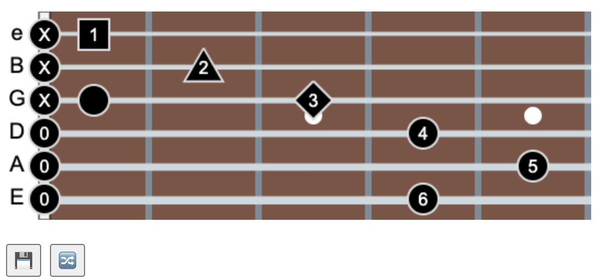

# Guitar Diagrams JS

## Overview

_Guitar Diagrams JS_ is an open source JavaScript library for drawing guitar chords and scales on an HTML5 canvas.

**Project:** <https://github.com/KCarlile/guitar-diagrams-js>\
**Version:** \
**Demo:** <https://demo.kcarlile.com/guitar-diagrams-js/>

### Why should you use Guitar Diagrams JS?

Guitar Diagrams JS is intended for instructional content developers publishing their own sites with musical instruction related to scales and chords for stringed instruments. It's a called Guitar Diagrams JS because the primary use is for guitarists, but it can also be used for bass, banjo, mandolin, dobro, violin (or fiddle), viola, cello, ukulele, and more!

The benefit of Guitar Diagrams JS is that it provides a visual representation of the instrument without requiring the content creator to design images graphically, download them, and embed them in HTML. The Guitar Diagrams JS library empowers you to create consistent scale and chord diagrams without ever needing to open a graphics program.

Here are some other comparisons to Guitar Diagrams JS:

| Name | Description | Visual | Graphical | Instrument Representation | No Sheet Music Reading | Works with Musical Passages | Cost |
| ---- | ----------- | ------ | --------- | ------------------------- | -------------- | ---------------- | ---- |
| Guitar Diagrams JS | Create diagrams with minimal code and no graphics | ✅ | ✅ | ✅ | ✅ | ❌ | $0 |
| Tablature (tabs) | Create diagrams manually with text | ✅ | ✅ | ⚠️ | ✅ | ✅ | $0, but time consuming and error prone |
| Graphic Design Software | Create diagrams manually with a graphic design program | ✅ | ✅ | ⚠️ | ✅ | ❌ | [\$22.99/month](https://www.adobe.com/products/photoshop/plans.html), and very time consuming |
| Sheet Music | Create sheet music | ✅ | ❌ | ❌ | ❌ | ✅ | [\$99](https://www.finalemusic.com/products/finale/special-pricing/) or [\$27.99/month](https://www.avid.com/sibelius/sibelius-ultimate-subscriptions?usertype=individual), and requires music notation proficiency |

Key: ✅Yes. ⚠️Maybe, sorta, kinda, optional. ❌ No.

## Project Lead/Owner and Contributors

### Project Lead/Owner

**Kenny Carlile**\
Website: [KCarlile.com](https://www.kcarlile.com/)\
GitHub profile: [@KCarlile](https://github.com/KCarlile)

### Contributors

 If you contribute to the project in any way (code, documentation, testing, etc.), your name will appear in the list of contributors below:

- @KCarlile (project lead/owner)
- @ckreiger1
- _Your name here_

## Documentation and Examples

Please see the following pages for more information:

- [`README.md`](README.md): this page
- [`docs/index.md`](docs/index.md): general usage documentation
- [`docs/api-docs.md`](docs/api-docs.md): API usage documentation
- [`docs/index.md`](docs/index.md): main landing page for project documentation
- [`docs/api-docs.md`](docs/api-docs.md): API usage documentation
- [`docs/code-owner-docs.md`](docs/code-owner-docs.md): technical documentation for code owners
- [`docs/examples/index.html`](docs/examples/index.html): usage examples
- [`docs/CODE_OF_CONDUCT.md`](docs/CODE_OF_CONDUCT.md): code of conduct for contributing members
- [`docs/CONTRIBUTING.md`](docs/CONTRIBUTING.md): instructions for contributing to the project
- [`LICENSE`](LICENSE): license file for the project

### Site Builder Examples

If you're a site builder using Guitar Diagrams JS, your site should be featured here as an example of how to use this library. Please [submit an Issue](https://github.com/KCarlile/guitar-diagrams-js/issues/new/choose) with a link to your site, plus any links to specific pages using Guitar Diagrams JS, and it will be added to the list below.

**Example sites:**

- [Guitar Diagrams JS demo/examples](https://demo.kcarlile.com/guitar-diagrams-js/)
- _Your site here!_

### Site Builders - Technical Information

You can find the full usage documentation at [`docs/index.md`](docs/index.md) and the API documentation at [`docs/api-docs.md`](docs/api-docs.md). The following information is just a high-level overview of how to use Guitar Diagrams JS.

#### Change Log

See the repository's [Releases page](https://github.com/KCarlile/guitar-diagrams-js/releases) for each release and associated release notes.

#### More Information

For more information, please see the [`docs/index.md`](docs/index.md) and [`docs/api-docs.md`](docs/api-docs.md) pages for general usage help and API documentation. See also the [`docs/examples/index.html`](docs/examples/index.html) page for usage examples.

### Code Owners - Technical Information

See [`docs/code-owner-docs.md`](docs/code-owner-docs.md) for documentation related to development and deployment.

### Dependency Requirements

There are no specific requirements[1](#footnotes) for dependencies to use Guitar Diagrams JS other than the standard browser compatibility considerations with CSS, JavaScript, and HTML 5's `<canvas>` tag. Browser compatibility for the `<canvas>` tag can be found on [the MDN `<canvas>` page](https://developer.mozilla.org/en-US/docs/Web/HTML/Element/canvas#browser_compatibility).

---

## References

- Color reference: <https://htmlcolorcodes.com/color-chart/>
- Canvas API reference: <https://www.w3schools.com/jsref/api_canvas.asp>
- Bootstrap API: <https://getbootstrap.com/docs/>
- How to Use GitHub Super Linter in Your Projects: <https://www.freecodecamp.org/news/github-super-linter/>
- GitHub Action - Super-Linter: <https://github.com/super-linter/super-linter/>
  - 
- GitHub Action - FTP Deploy: <https://github.com/SamKirkland/FTP-Deploy-Action>
  - 

### Footnotes

1. The [examples page](docs/examples/index.html) leverages the following dependencies for convenience, but they are not requried for Guitar Diagrams JS usage.
   - [Bootstrap framework](https://getbootstrap.com/) is used for easier layout and formatting.
   - [highlight.js](https://highlightjs.org/) is used for syntax highlighting in the code examples.
